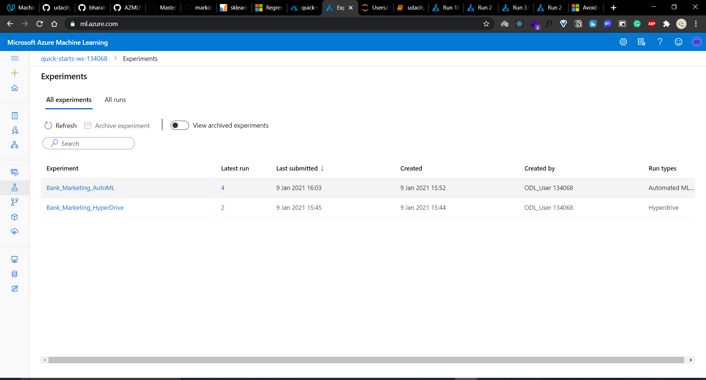
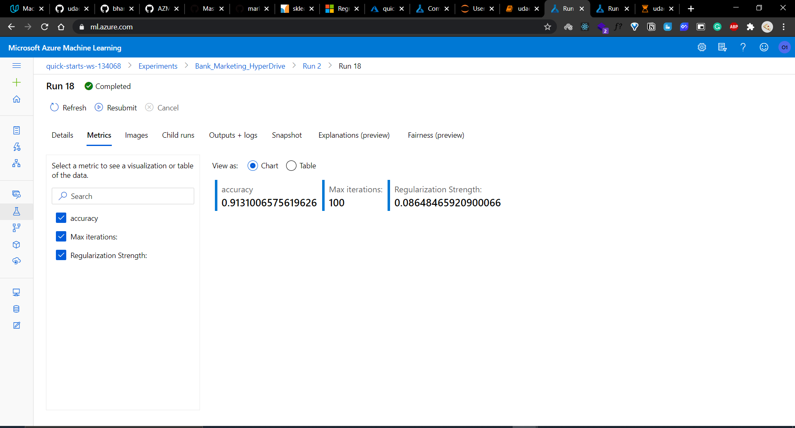
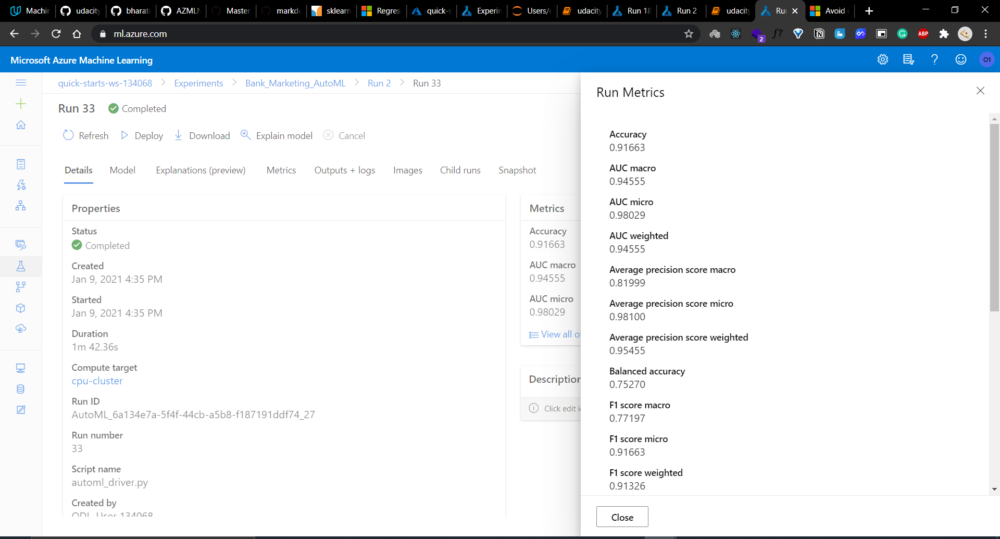
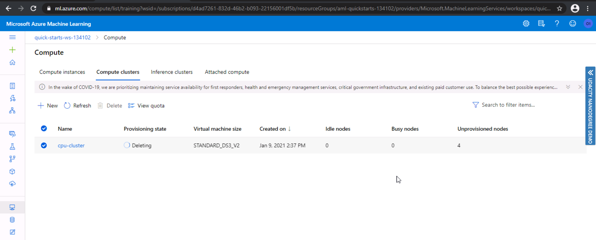

# OPTIMIZING AN ML PIPELINE IN AZURE

## TABLE OF CONTENTS
1. [Overview](#overview)
1. [Summary](#summary)
   1. [Problem](#problem)
   1. [Project Workflow Steps](#project-workflow-steps)
   1. [Solution Summary](#solution-summary)
   1. [Result Summary](#result-summary)
1. [Approaches](#approaches)
   1. [Scikit-Learn Pipeline](#scikit-learn-pipeline)
      1. [Data Preparation](#data)
      1. [Scikit-Learn Logistic Regression Algorithm](#scikit-learn-logistic-regression-algorithm)
      1. [Hyperparameter Tuning using HyperDrive](#hperparameter-tuning-using-hyperDrive)
      1. [Submitting and Saving the Best Model](#submitting-and-saving-best-model)
      1. [Best Run Results](#best-run-results)
   1. [AutoML](#automl)
      1. [Data Preparation](#data)
      1. [AutoML Configuration](#auto-ml-configuration)
      1. [Submitting and Saving the Best Model](#submitting-and-saving-best-model)
      1. [Best Run Results](#best-run-results)
1. [Pipeline Comparison](#pipeline-comparison)
1. [Future Work](#future-work)
1. [Proof of Cluster Clean Up](#proof-of-cluster-clean-up)

## Overview
This project is part of the Udacity Azure ML Nanodegree.
In this project, we build and optimize an Azure ML pipeline using the Python SDK and a provided Scikit-learn model.
This model is then compared to an Azure AutoML run.

## Summary
### Problem
- This project uses a Bank Marketing Dataset from the [USI Machine Learning Repository](https://archive.ics.uci.edu/ml/datasets/Bank+Marketing).
- The dataset conatins personal details about clients such as age, job, marital status, education, etc among other attributes. 
- This is a **_classification_** (2 class-classification) problem with the goal to predict whether or not a client will subscribe to a term deposit with the bank. 
- The data is classified using the column label y in the dataset that contains binary values ('yes' and 'no')**.

### Project Workflow Steps

### Solution Summary
.
- This project used two approaches to find the best possible model for classifying the given dataset:
  - Scikit-Learn based logistic regression which used the HyperDrive for effective hyperparameter tuning
  - Automated Machine Learning was used to build and choose the best model
 
### Result Summary
* The best performing model was a **_VotingEnsemble_** algorithm that was selected through AutoML with an accuracy of **0.91663**.
* The Logistic Regression model whose hyperparameters were tuned using HyperDrive gave an accuracy of **0.9131**.

## Approaches
- Two approaches were used in this project to classify the given data and come up with the best possible model:
  1. A Scikit-Learn Pipeline Regression
  1. Automated ML (AutoML)
- Both these approaches were extecuted using _Jupyter Notebook and the Azure ML SDK_.

### Scikit-Learn Pipeline:
- This approach uses the Scikit-learn Logistic Regression algorithm to train the model with the dataset. The hyperparameters for Logistic Regression are chosen and optimized using the HyperDrve to obtain the best model with the highest accuracy.
#### Data Preparation
- The dataset is loaded from the given [URL](https://automlsamplenotebookdata.blob.core.windows.net/automl-sample-notebook-data/bankmarketing_train.csv) into the notebook using the _TabularDatasetFactory_ class.
- The given dataset is then cleaned using the clean_data() method predefined in the [train.py file](https://github.com/bharati-21/AZMLND_Optimizing_a_Pipeline_in_Azure/blob/master/train.py) that performs various preprocessing steps (such as one hot encoding) on the data, after which the data is split into train and test sets in 70-30 ratio.
#### Scikit-Learn Logistic Regression Algorithm
- The split train data is then fed to the scikit-learn based logistic regression algorithm which takes in 2 hyperparameters: `--C`, which is the inverse of regularization strength and `--max-iter`, which is the maximum number of iterations that should be taken to converge.
#### Hyperparameter Tuning using HyperDrive
- The HyperDrive package is used to optimize tuning of hyperparameters by using the HyperDriveConfig() that takes in several configuration attributes:
  1. Estimator (`est`): An `SKLearn` estimator is used to begin the training and invoke the training script file.
  1. Parameter sampler (`hyperparameter_sampling `): A `RandomParameterSampling` sampler is used to randomly select values specified in the search space for the two parameters of Logistic Regression algorithm (--c and --max_iter).
  1. Policy (`policy`): An early termination policy, `BanditPolicy`, is passed to ensure low performing runs are terminated and resources are not wasted.
  1. Primary Metric (`primary_metric_name`): The primary metric for evaluating runs is specified. The project uses `accuracy` as the primary metric with the goal (`primary_metric_goal`) value `primary_metric_goal.MAXIMIZE` to maximize the primary metric in every run.
  1. Resources for controlling and running the experiment is specified using `max_concurrent_runs` (Maximum number of runs that can run concurrently in the experiment) and `max_total_runs` (Maximum number of training runs). 
#### Submitting Run and Saving the best model
- The Hyperdrive run is then submitted to the experiment which takes the hyperdrive configuration details as a parameter. Once the run is completed, the best metrics are obtained using `run.get_best_run_by_primary_metric()` and the model is tested for primary_metric (accuracy) using the test data from the script file. The best run is then registered after invoking `register_model()`.
#### Best Run Result

- `Run ID`: HD_160377e7-7ee0-40f1-a79b-21cbcd7ffec6_13
- `Run Accuracy`: 0.9131006575619626
- `Run Learning Rate`: 100
- `Parameter Values`: ['--C', '0.08648465920900066', '--max_iter', '100']

- **What are the benefits of the parameter sampler you chose?**
  - Random Sampling works with both discrete and continous search space unlike Grid Sampling. It also supports early termination policy unlike Bayesian Sampling. Hence Random Sampler helps in performing trial and error with values chosen over the search space and then refine the search space in subsequent runs to obtain best results.
- **What are the benefits of the early stopping policy you chose?**
  - Early stopping helps in avoiding unnecessary usage of resources assigned to runs that performs poorly. This is ensured by terminating runs whose primary metric is not within the slack amount specified by the policy. 

### AutoML
- AutoML (Automated Machine Learning) is used to simplify various time intensive Machine Learning tasks such as feature engineering, feature selection, hyperparameter selection, training, etc.
- This approach uses AutoML to automate the process of choosing an algorithm, and the values of hyperparameters for the chosen algorithm that will result in the best model with the highest accuracy. 
#### Data Preparation
- The same Bank Marketing Dataset from the [USI Machine Learning Repository](https://archive.ics.uci.edu/ml/datasets/Bank+Marketing) is classified again by using AutoML.  
- The dataset is uploaded from the URL via the _TabularDatasetFactory_ class. The data is then cleaned using clean_data from the [train.py file](https://github.com/bharati-21/AZMLND_Optimizing_a_Pipeline_in_Azure/blob/master/train.py), and then split into train and test sets in 70-30 ratio .
#### AutoML Configuration
- The `AutoMLConfig` object takes attributes required to configure the experiement run such as: 
  1. Experiment Timeout (`experiment_timeout_minutes`): Maximum amount of time (in minutes) that all iterations combined can take before the experiment terminates. 
  1. Task to be performed (`task`): The tpye of task that needs to be run such as classification, regression, forecasting etc. In this project `classification` is the task to be performed.
  1. Primary Metric (`primary_metric`): The primary metric which is used to evaluate every run. In this case, `accuracy` is the primary metric to be evaluated.
  1. Training Data (`training_data`) = The _TabularDataset_ that contains the training data.
  1. Label Column (`label_column_name`): Name of the column that needs to be predicted. In this case the column that contains "yes" or "no" to perform classification.
  1. Cross Validations (`n_cross_validations`): Specifies the number of cross validations that needs to be performed on each model by splitting the dataset into n subsets.
  1. Compute Target (`compute_target`): The cluster used to run the experiment on. 
#### Submitting Run and Saving the Best Model
- The AutoML run is then submitted to the experiment which takes the automl configuration details as the parameter. Once the run is completed, the best run and fitted model are obtained using `run.get_output()` and the model is tested for primary_metric (accuracy) using the test data from the script file. The best run is then registered after invoking `register_model()`. The metrics were obtained using `get_tags()`.
#### Best Run Result 

- `Run ID`: AutoML_6a134e7a-5f4f-44cb-a5b8-f187191ddf74_27
- `Run Accuracy`: 0.9164968567092998
- `ensembled_iterations`: [1, 0, 20, 23, 10, 5, 26, 7, 4]
- `ensembled_algorithms`: ['XGBoostClassifier', 'LightGBM', 'RandomForest', 'LogisticRegression', 'LogisticRegression', 'XGBoostClassifier', 'LightGBM', 'XGBoostClassifier', 'RandomForest']
- `ensemble_weights`: [0.2, 0.2, 0.06666666666666667, 0.06666666666666667, 0.06666666666666667, 0.06666666666666667, 0.06666666666666667, 0.06666666666666667, 0.2]

## Pipeline Comparison
- The experiment run and model trained for the datsaset using AutoML gave a higher accuracy (0.9165) than the model trained using Scikit-learn pipeline (0.9131) for the same dataset.
- Although the difference in accuracy between the two approaches is not large, this difference can be attributed to the difference in pipeline architecture and experiment steps.
- The experiment run using the scikit-learn architecture only uses one algorithm- Logistic Regression. Whereas the experiment run using AutoML tests various algorithms for the same dataset to find the best model.
- The hyperparameter search space, and the sampling method was manually entered in the HyperDrive experiment but experiment run using AutoML tuned and optimized this search for hyperparameters to find the best suitable model.
- Early termination policy was also mentioned in the HyperDrive experiment but that was chosen automatically in the AutoML experiment.
- The very less difference in accuracy for the two approaches can also be attributed by the fact the same dataset was used for both the runs.
- Also, it can be time consuming to try out different Algorithms for the HyperDrive experiment since different pipelines need to be built for every possible algorithm.
- It was also observed that the AutoML approach required less manual intervention and coding compared to the HyperDrive approach.

## Future Work
- For the HyperDrive experiment, Grid Sampling can be used as the sampling method to conduct an exhaustive search for hyperparameters to try for better accuracy.
- Various pipelines can also be built for the HyperDrive experiment for different kinds of algorithms that were used in AutoML experiment.
- Theoretically, a thorough review and study of the technique behind AutoML approach can be performed which can then be applied to the HyperDrive experiment.
- The Class balancing problem can be reviewed and fixed to decrease bias to avoid falsely perceived positives.
- In the HyperDrive run experiment the search space can be changed and explored further using trial and error method to obtain better metric goals.

## Proof of Cluster Clean Up

